# Leona's cat Café
This is a website for a local cat café in Stockholm.
You can look at this project by clicking on the deployed link: https://ikayherce.github.io/Leonascatcafe/index.html 

 

 ## Table of contents
### -Description 
### -User demographic 
### -Features
### -Initial planning
### -Existing features
### -Testing
### -Validator testing
### -Unfixed Bugs
### -Development and deployment
### -Credits
 
## Description 
 Leona's cat café is a cosy place to hang out with friends, work or have a relaxing time accompanied by shelter cats that are up for adoption. All the drinks and food are high-quality and plant-based. 

## User demographic
Leona's cat café is for anyone who likes cats and wants a serotonin booster along with good coffee and pastries. This makes the café appealing to people all ages, from families with children to teenagers or young couples and of course senior citizens. When it comes to gender, the cat café demographic is dominated by women. 
Leona's cat café is located in the suburban area Kärrtorp in the south of Stockholm. This area is known for being calm and trendy and is mostly populated by senior citizens, young families, young couples and young professionals. This makes Kärrtorp the ideal location for a cat café.      
 
## Features
Leona's cat café is a website with three pages: 1)a home page introducing the café with a brief "about" section about the business and the menu, 2)a page with pictures and description of the resident cats to meet or adopt, 3) a form page to book a visit. 

### Initial planning
### Wireframes
This is what the initial planning looked like. 
 
 

### Existing features
#### Navbar
The navbar has a toggle down menu in smaller screens to optimize the use of real estate.

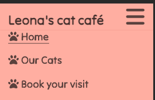

#### Landing page image 
The landing page image, found on www.unsplash.com, provides the user with an idea of what they can expect to experience at the cat café. 
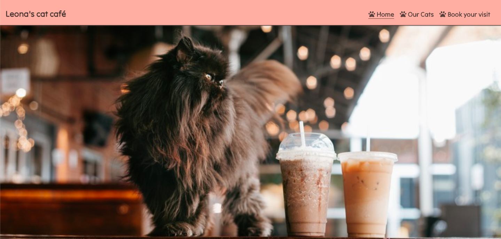
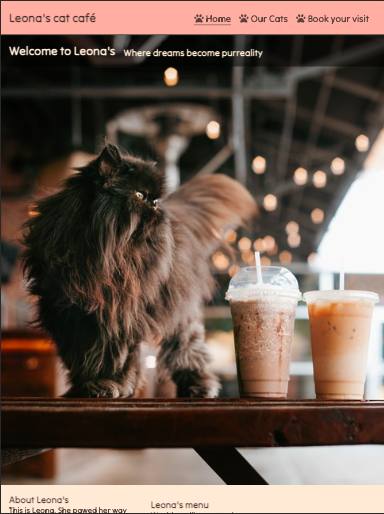
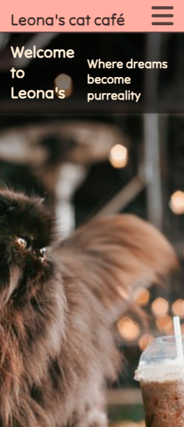
#### About section
The about section describes the business and the menu for the user.
#### Footer
The footer contains the address and opening hours of the café as well as links to the social media of Leona's cat café. An embedded google maps link was placed at the beginning but it has been replaced with a screenshot of the map instead since the link produced errors.
#### Gallery "our cats"
The 'Our Cats' page functions as a gallery and shows the user more of what they will experience at the café. In this case it is of course the cats they will get to meet. 
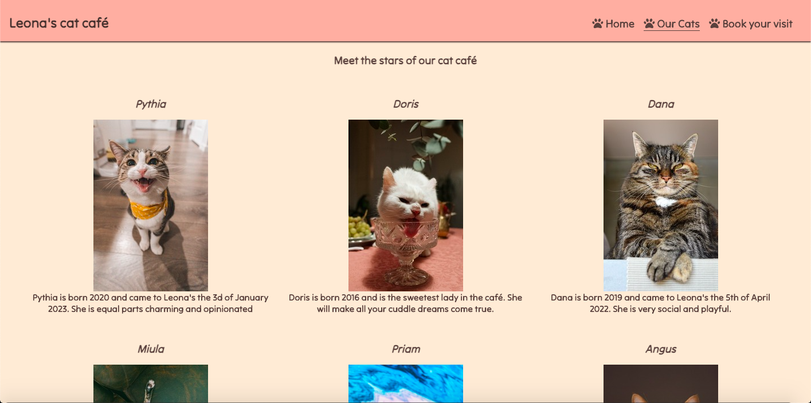
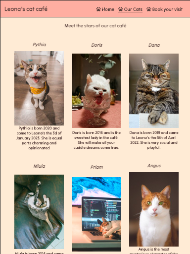
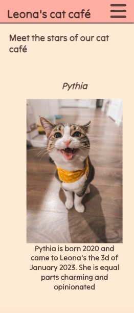
#### Form 
Lastly, the users are provided with a form page where they can book their visit to the cat café. A date and time chooser fields as well as radio buttons to pick the duration of the visit are included, and all fields are required. 
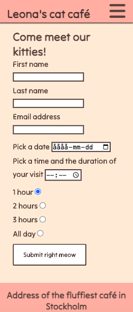
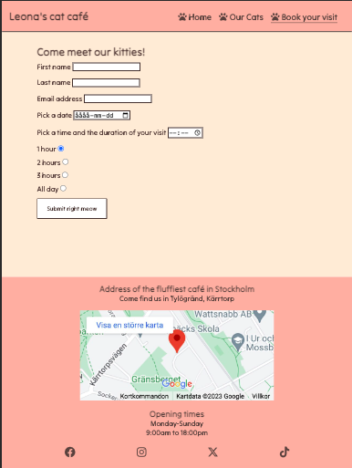

## Technologies used
The website "Leona's cat café" has been built with html and CSS.
The IDEs used have been Code Anywhere and Gitpod and the repository has been hosted in the platform Github. 

## Design
### Choice of color palette 
Pastels and pink are trendy and appeal to the demographic who dominates in cat cafés. That is why I chose a bold but still soft pink-salmon shade and a cream shade combined  with dark brown text to achieve a good contrast. 
I used https://mycolor.space/ for inspiration and experimented until I found the right combination. 
#### Combinations suggested by https://mycolor.space/ 
 
 
#### Final combination of my choice
 
### Choice of font
I chose 'Tilt Neon' (sans-serif) as the only font for a playful, yet sleek look to the website.  

## Testing
### Manual testing
- Social media links open correctly and open in a new tab
- Form provides feedback when sent
- Form provides feedback when user does not include @ in email address or does not fill in a field
- Site is responsive accross all devices
### Lighthouse report 
 
### Validator testing
#### HTML Validator   
 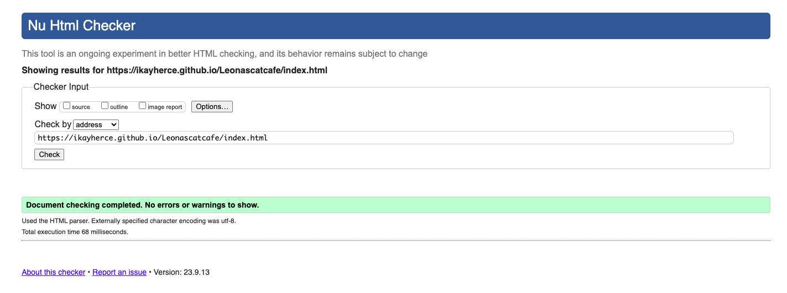
 
 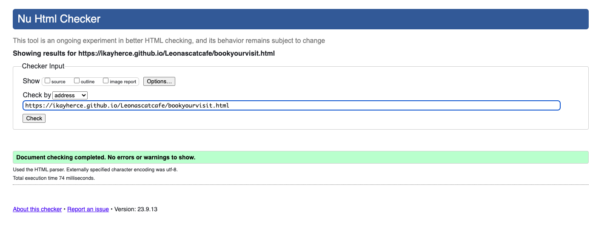
####  CSS Validator
 

## Development and deployment
This is what the process has looked like:
1- Creation of empty repository in Github using Code Institute's repository template.  
2- Use of git add and git commit with message in the process of creating my code.
3- Git push to push the local git up to Github. 
4- Deployment from the Github repository https://github.com/Ikayherce/Leonascatcafe .

## Unfixed bugs
The page 'Ourcats.html' sometimes shows an overflow when you open it in a cell phone.  I couldn't identify why it happens, but when it does refreshing the page solves it. 

## Credits
### Content
The content in "about our menu" in the home page has been inspired in the website www.purrfectcafe.se.
The code for the home page, especially the navbar, is inspired in the Love Running walkthrough project by Code Institute.
### Media
The cat pictures, except the "Leonaabout" picture which is my cat Leona, have been found in www.unsplash.com 

